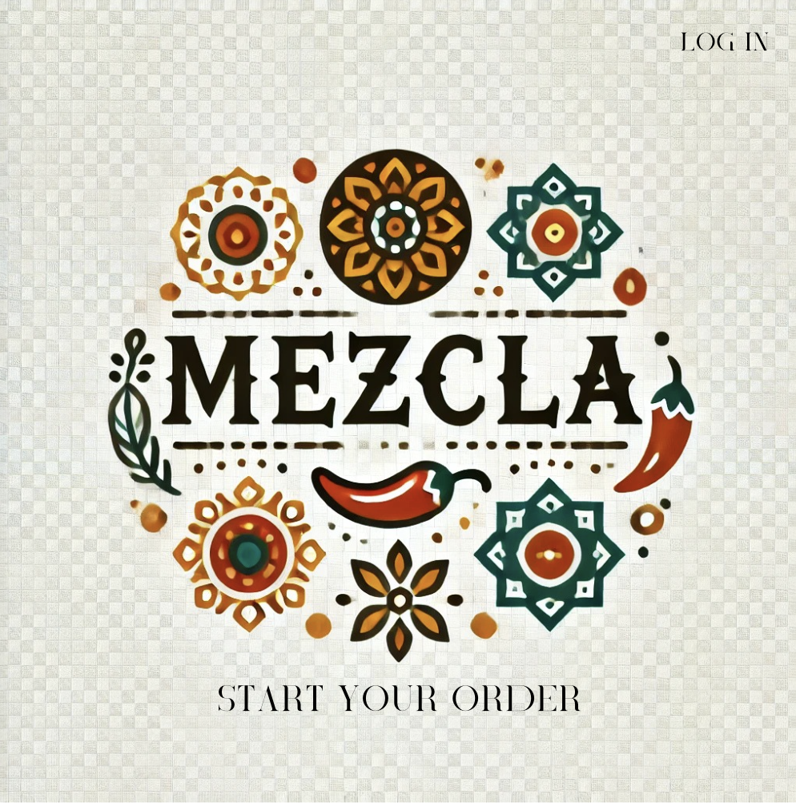
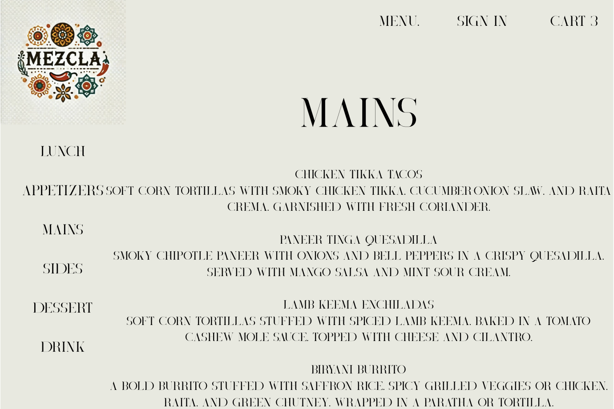
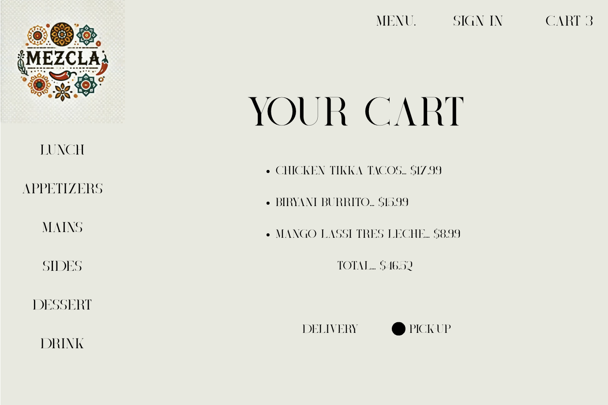

# Mezcla
**Mezcla** in an Indian-Mexican fusion restaurant. They do a lot of takeout orders and wanted to make their website easy and user-friendly for customers to place food orders.

## Project Description 

The **Mezcla** website is intended for users to be able to place their food orders easily and conveniently. Users will be able to add view the menu in its entirety as well as select specific categories of the menu. Users will be able to easily add items to their cart. The cart will display the total number of items (or a running total). First time users will have the option to sign up, while returning users will have the option to sign in. Users will have the choice of pick-up or delivery. Users that choose delivery will be prompted to enter their address. Once the user has selected what they want, check out will be fast and once payment is complete, there will be a screen letting the user know that the payment has been completed and an approximate time that their food will be ready.  

## Wire Frames

**Initial Landing View**

**Menu Page**

**Check-out**

## User Stories

#### MVP Goals

-As an AAU, I should be able to easily and clearly navigate to the menu upon arriving on the landing page.

-As an AAU, I should be able to view the menu as a whole or select a specific section.

-As an AAU, I should be able to easily add items to my cart. The cart icon should indicate the number of items or a running total. 

-As an AAU, I should be able to edit or delete items in the cart.

As an AAU, I should be able to choose if I want to pick-up the food or have it delivered. I should be prompted to enter my address if I choose to have it delivered. 

#### Stretch Goals

- AAU's should have the ability to customize food orders: adding items or leaving a note for the restaurant.
- In addition to the AAU view, there could be a user profile for the restaurant owner to edit the restaurant page: adding, editing, or deleting menu items.

## ERD

## RESTful Routes

| Resource           | HTTP Method | Route Path                | Purpose                             |
|--------------------|-------------|---------------------------|--------------------------------------|
| **Customers**      | `GET`       | `/customers`              | View all customers (admin)           |
|                    | `GET`       | `/customers/:id`          | View one customer                    |
|                    | `POST`      | `/customers`              | Register a new customer              |
|                    | `PUT`       | `/customers/:id`          | Update a customer profile            |
|                    | `DELETE`    | `/customers/:id`          | Delete a customer                    |
| **Menu Items**     | `GET`       | `/menu_items`             | View all menu items                  |
|                    | `GET`       | `/menu_items/:id`         | View one menu item                   |
|                    | `POST`      | `/menu_items`             | Add a new menu item (admin)          |
|                    | `PUT`       | `/menu_items/:id`         | Edit a menu item (admin)             |
|                    | `DELETE`    | `/menu_items/:id`         | Delete a menu item                   |
| **Orders**         | `GET`       | `/orders`                 | View all orders (admin/staff)        |
|                    | `GET`       | `/orders/:id`             | View specific order                  |
|                    | `POST`      | `/orders`                 | Place a new order                    |
|                    | `PUT`       | `/orders/:id`             | Update order status                  |
|                    | `DELETE`    | `/orders/:id`             | Cancel an order                      |

