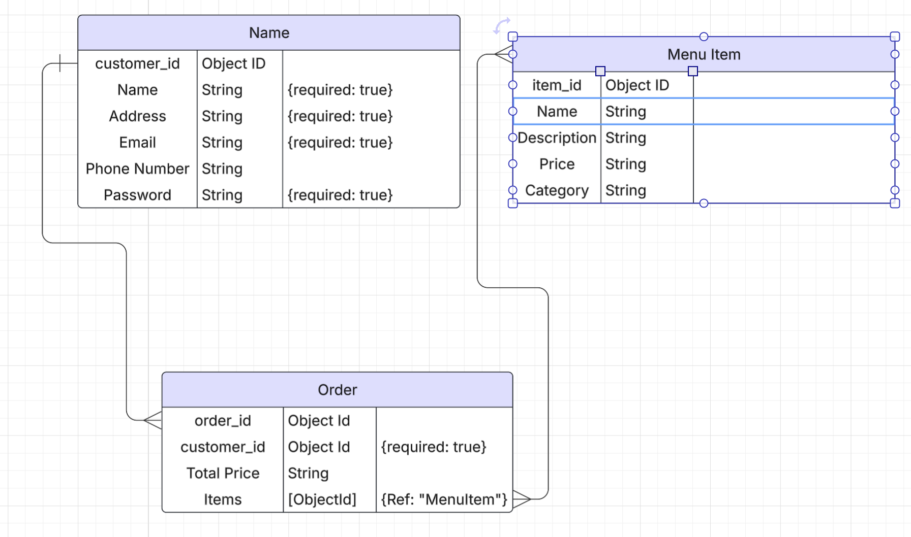
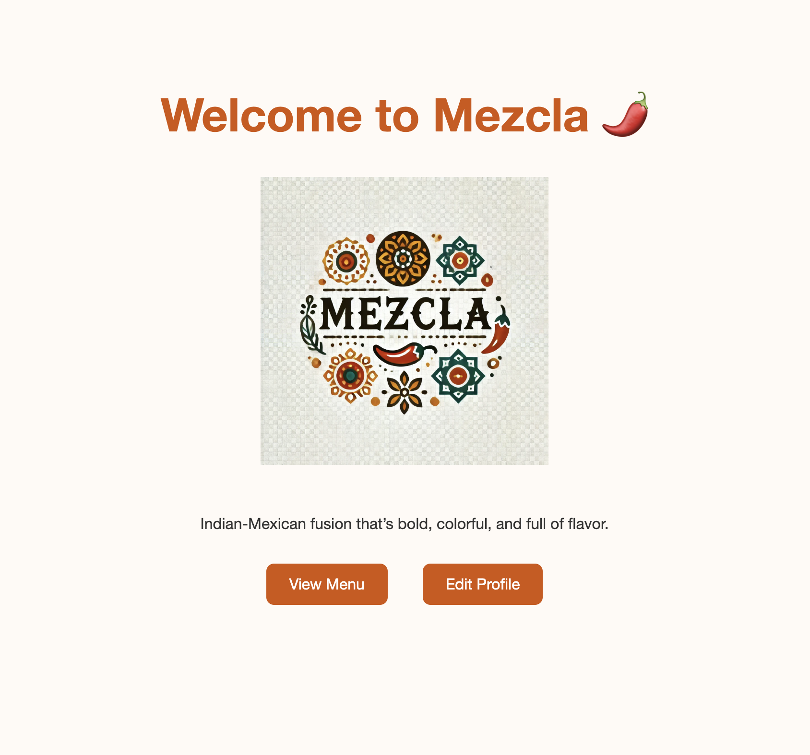

# Mezcla

## Mezcla
**Mezcla** is Spanish for "mixture." It is an Indian-Mexican fusion restaurant. It satisfies all CRUD fuctionalities as well as session based authorization/authentication. Users are able to sign in in order to access the menu. They can add items to their cart. They can edit their cart before choosing to pick their food up or have it delivered.

## ERD

## Screenshot: 

## Getting started: 
1. [Deployed Link](mezcla-production.up.railway.app)
2. [Planning Materials](https://github.com/rednaldeirf/Mezcla/blob/main/Proposal.md)

## Technologies used: 
* Frontend: HTML, CSS, EJS
* Backend: Javascript, node, express
* Database: Mongoose, MongoDB
* Authorization/Authentication: bcrpt, express-session
* ChatGPT

## Next steps: 
In the future, I would like to: 
* Enhance the **UI** experience;
* Changes to the cart;
* CSS style sheet;
* Checkout experience;